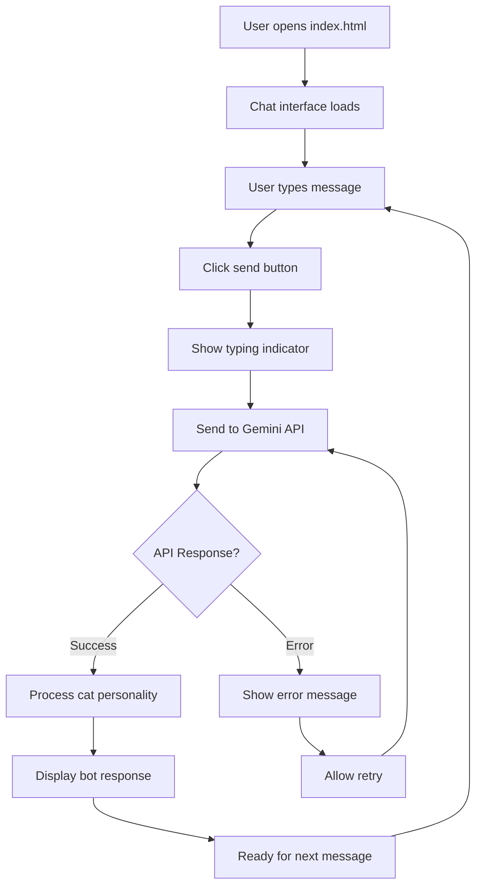

# Meow GPT Architecture Plan

## Project Overview
A web-based chat interface that acts as a helpful cat assistant using Google's Gemini API. The application will provide helpful responses with cat puns and references while maintaining a friendly, feline personality.

## Technical Stack
- **Frontend**: HTML5, CSS3, Vanilla JavaScript
- **API**: Google Gemini API (generative-ai)
- **Deployment**: Static files (can be opened directly in browser)
- **No Backend Required**: Client-side only implementation

## Application Architecture

### File Structure
```
meow-gpt/
├── index.html          # Main application file
├── styles.css          # Cat-themed styling
├── script.js           # Core functionality
├── config.js           # API configuration
└── README.md           # Setup instructions
```

### Core Components

#### 1. HTML Structure (`index.html`)
- Chat container with cat-themed header
- Message display area with user/bot message bubbles
- Input field with send button (paw-shaped)
- Loading indicator (spinning cat)
- Error display area

#### 2. CSS Styling (`styles.css`)
- Cat color scheme (orange, black, white, cream)
- Paw print backgrounds and decorations
- Smooth animations for message appearance
- Responsive design for mobile/desktop
- Cat emoji and icon integration
- Typing indicator with animated dots

#### 3. JavaScript Functionality (`script.js`)
- Message handling and DOM manipulation
- Gemini API integration
- Cat personality prompt engineering
- Error handling and retry logic
- Local storage for chat history
- Responsive UI updates

#### 4. Configuration (`config.js`)
- API key management
- Gemini model settings
- Cat personality prompts
- Response formatting rules

## API Integration Details

### Gemini API Setup
- **Endpoint**: `https://generativelanguage.googleapis.com/v1beta/models/gemini-pro:generateContent`
- **Authentication**: API Key in header
- **Model**: gemini-pro (text generation)
- **Request Format**: JSON with prompt and parameters

### Cat Personality Implementation
- System prompt to establish cat assistant personality
- Response post-processing to add cat puns
- Emoji integration (🐱, 🐾, 😸, etc.)
- Cat-related vocabulary injection

## User Experience Flow



## Key Features

### 1. Cat Personality System
- Helpful responses with occasional cat puns
- Cat-themed greetings and sign-offs
- Purr-fect spelling of certain words
- Cat behavior references (napping, hunting, playing)

### 2. Visual Design
- Warm cat colors (orange, cream, brown)
- Paw print decorations
- Cat silhouette header
- Smooth message animations
- Mobile-responsive layout

### 3. Technical Features
- Real-time chat interface
- Message history persistence
- Error handling with user-friendly messages
- Loading states and animations
- Keyboard shortcuts (Enter to send)

## Security Considerations
- API key stored in client-side config (user responsibility)
- No sensitive data storage
- HTTPS recommended for production use
- Rate limiting handled by Gemini API

## Performance Optimizations
- Minimal dependencies (vanilla JS)
- Efficient DOM manipulation
- Lazy loading of chat history
- Optimized CSS animations
- Compressed assets

## Browser Compatibility
- Modern browsers (Chrome, Firefox, Safari, Edge)
- ES6+ JavaScript features
- CSS Grid and Flexbox
- Fetch API for HTTP requests

## Deployment Options
1. **Local File**: Open `index.html` directly in browser
2. **Static Hosting**: Upload to GitHub Pages, Netlify, or Vercel
3. **Web Server**: Serve via any HTTP server (Python, Node.js, etc.)

## Future Enhancements
- Voice input/output
- Chat export functionality
- Multiple cat personalities
- Theme customization
- Offline mode with cached responses